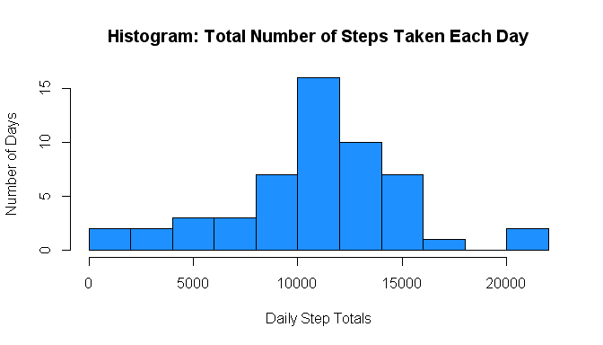
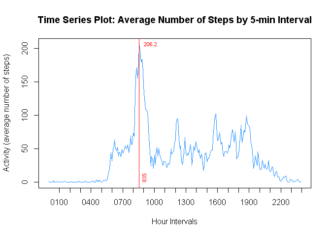
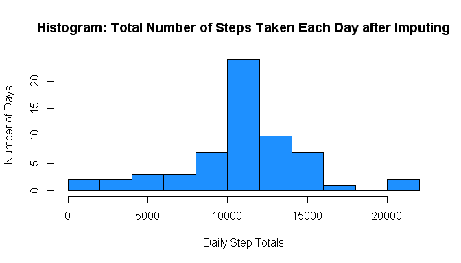
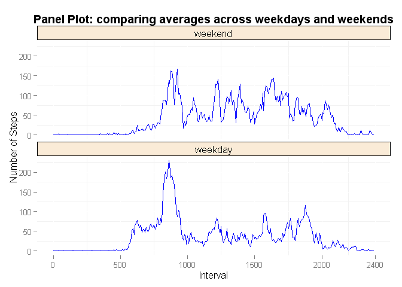

# Reproducible Research: Peer Assessment 1

## Loading and preprocessing the data

### 1.  Load the data

The data is supplied in a ZIP file, which R can read directly:


```r
data <- read.csv(unz("activity.zip","activity.csv"))
```

Let's take a look at what the raw data looks like:


```r
head(data)
```

```
##   steps       date interval
## 1    NA 2012-10-01        0
## 2    NA 2012-10-01        5
## 3    NA 2012-10-01       10
## 4    NA 2012-10-01       15
## 5    NA 2012-10-01       20
## 6    NA 2012-10-01       25
```


### 2.  Process/transform the data

So that the x-axis time intervals will be linear, build a new column containing the HHMM interval converted to decimal hours:


```r
# Left pad the intervals with zeros to be a uniform four characters wide
padded_intervals <- sprintf("%04d", data$interval)

# Pick off the hours portion (which are already "decimal")
decimal_hours <- as.numeric(substr(padded_intervals, 1,2))

# Pick off the minutes portion and divide by 60 to convert to decimal hours
decimal_mins <- as.numeric(substr(padded_intervals, 3,4)) / 60

# Add hours and decimal minutes together to get decimal intervals
decimal_interval <- decimal_hours + decimal_mins

# Save the decimal intervals into a new column in the data set
data$decimal_interval <- decimal_interval
```

Let's take a look at what the processed data looks like:


```r
head(data)
```

```
##   steps       date interval decimal_interval
## 1    NA 2012-10-01        0       0.00000000
## 2    NA 2012-10-01        5       0.08333333
## 3    NA 2012-10-01       10       0.16666667
## 4    NA 2012-10-01       15       0.25000000
## 5    NA 2012-10-01       20       0.33333333
## 6    NA 2012-10-01       25       0.41666667
```

## What is mean total number of steps taken per day?

### 1.  Calculate the total number of steps taken per day

As instructed, we're ignoring the missing values in the dataset.


```r
totals_by_day <- aggregate(data$steps, list(data$date), sum)

# Set meaningful column names
colnames(totals_by_day) <- c("date", "sum")
```

Let's take a look at what the processed data looks like:


```r
head(totals_by_day)
```

```
##         date   sum
## 1 2012-10-01    NA
## 2 2012-10-02   126
## 3 2012-10-03 11352
## 4 2012-10-04 12116
## 5 2012-10-05 13294
## 6 2012-10-06 15420
```


### 2.  Make a histogram of the total number of steps taken each day

Set up the plotting parameters:


```r
par(lab=c(15,5,7),
    las=3,
    cex.axis=0.7)
```
    
Make the histrogram of the total number of steps taken each day:


```r
hist(totals_by_day$sum,
     breaks=10,
     col = "dodgerblue",
     main = "Histogram: Total Number of Steps Taken Each Day",
     xlab="Daily Step Totals",
     ylab="Number of Days")
```

 
     
### 3.  Calculate and report mean and median of total steps taken per day

Calculate the mean and median total number of steps per day:


```r
mean_total_steps_per_day <- sprintf("%f",mean(totals_by_day$sum, na.rm=TRUE))

# Calculate the median of the total number of steps per day
median_total_steps_per_day <- sprintf("%f",median(totals_by_day$sum, na.rm=TRUE))
```


####Mean number of steps taken each day: **10766.188679**  
####Median number of steps taken each day: **10765.000000**


## What is the average daily activity pattern?

### 1.  Make a time series plot of the 5-minute interval (x-axis) and the average number of steps taken, averaged across all days (y-axis)

Calculate the average number of steps in each 5-minute interval:


```r
average_by_interval <- aggregate(data$steps, list(data$decimal_interval), mean, na.rm=TRUE)

# Set meaningful column names
colnames(average_by_interval) <- c("decimal_interval", "average")
```

Take a look at the results:


```r
head(average_by_interval)
```

```
##   decimal_interval   average
## 1       0.00000000 1.7169811
## 2       0.08333333 0.3396226
## 3       0.16666667 0.1320755
## 4       0.25000000 0.1509434
## 5       0.33333333 0.0754717
## 6       0.41666667 2.0943396
```

For reference, add a column containing the original 5-minute intervals:


```r
# Pick off the hours portion
hours <- as.character(as.integer(average_by_interval$decimal_interval))

# Pick off the minutes decimal fraction and multiple by 60 to convert to minutes
minutes <- as.character(round(average_by_interval$decimal_interval%%1 * 60), digits=0)

# Left pad the minutes string with zero to be two characters wide
minutes <- paste("00", minutes, sep="")
minutes <- substr(minutes, nchar(minutes)-2+1, nchar(minutes))

# Create column to contain the character interval
average_by_interval$interval <- as.integer(paste(hours, minutes, sep=""))
```

Take a look at the results:


```r
head(average_by_interval)
```

```
##   decimal_interval   average interval
## 1       0.00000000 1.7169811        0
## 2       0.08333333 0.3396226        5
## 3       0.16666667 0.1320755       10
## 4       0.25000000 0.1509434       15
## 5       0.33333333 0.0754717       20
## 6       0.41666667 2.0943396       25
```

Set plotting parameters

```r
par(lab=c(10,5,50),
    las=2,             # Make labels perpendicular to axis
    cex.axis=0.7)      # Axis labels magnification
```

Generate the plot:


```r
plot(average_by_interval$decimal_interval, average_by_interval$average,
     type = "l",
     col = "dodgerblue",
     main = "Time Series Plot: Average Number of Steps by 5-min Interval",
     xlab="Hour Intervals",
     ylab="Activity (average number of steps)",
     xaxt="n")
    
# Make neater x axis labels
hour_labels <- paste("0",as.character(c(1:24)), sep="")
hour_labels <- substr(hour_labels, nchar(hour_labels)-2+1, nchar(hour_labels))
hour_labels = paste(hour_labels, "00", sep="")

# Apply custom x asis labels
axis(1, 1:24, hour_labels)

# Find which row index contains the largest average value
largest_avg_index <- which.max(average_by_interval$average)

# Use that index to find associated decimal interval for an accurate line
largest_avg_decimal_interval <- average_by_interval[largest_avg_index,]$decimal_interval

# Then get the text interval for labeling the line
largest_avg_interval <- average_by_interval[largest_avg_index,]$interval

# And save the steps to a variable for tagging the line
largest_avg_steps <- round(average_by_interval[largest_avg_index,]$average, digits=1)

# Draw a red line at the max steps
abline(v=largest_avg_decimal_interval, col="red")

# Add the max steps value near max point
text(largest_avg_decimal_interval, largest_avg_steps, largest_avg_steps , col="red",
     cex=0.7, pos=4)

# Add interval name near base of red line
text(largest_avg_decimal_interval, 0, largest_avg_interval , col="red", cex=0.7,
     pos=4, srt=90)
```

 


### 2.  Which 5-minute interval, on average across all the days in the dataset, contains the maximum number of steps?

####5-minute interval that, on average, contains the maximum number of steps: **835**.


## Imputing missing values

### 1.  Calculate and report the total number of missing values in the dataset (i.e. the total number of rows with NAs)

Find how many rows in the orignal dataset had an NA for steps:


```r
total_missing_values <- sum(is.na(data$steps))
```

####The number of missing values is **2304**.


### 2.  Devise a strategy for filling in all of the missing values in the dataset.

It appears that all NAs occur for an entire day at a time.

We'll use an imputing strategy where the NA step values are replaced by the mean value for that interval.  Table "average_by_interval" can be used as the source for replacement values.

### 3.  Create a new dataset that is equal to the original dataset but with the missing data filled in

Make a copy of the original dataset to use for filling:


```r
data_filled <- data
```

Fill the step NAs with corresponding interval averages:


```r
# Find indexes of the steps that are NA
na_steps <- which(is.na(data_filled$steps))

# Get the intervals of those steps
na_interval <- data_filled$interval[na_steps]

# For the indexed NA steps, replace with matched intervals
data_filled$steps[na_steps] <- average_by_interval$average[match(na_interval,
                                  average_by_interval$interval)]
```

### 4.  Make a histogram of the total number of steps taken each day and Calculate and report the mean and median total number of steps taken per day. Do these values differ from the estimates from the first part of the assignment? What is the impact of imputing missing data on the estimates of the total daily number of steps?

## What is mean total number of steps taken per day?

Calculate the total number of steps for each day based on the filled data:


```r
totals_by_day_filled <- aggregate(data_filled$steps, list(data_filled$date), sum)

# Set meaningful column names:
colnames(totals_by_day_filled) <- c("date", "sum")
```

Set plotting parameters:


```r
par(lab=c(15,5,7),
    las=3,
    cex.axis=0.7)
```

Histogram of the filled table:


```r
hist(totals_by_day_filled$sum,
     breaks=10,
     col = "dodgerblue",
     main = "Histogram: Total Number of Steps Taken Each Day after Imputing",
     xlab="Daily Step Totals",
     ylab="Number of Days")
```

 
     

```r
# Calculate the filled mean  and medial of total number steps per day
mean_total_steps_per_day_filled <- sprintf("%f",mean(totals_by_day_filled$sum, na.rm=TRUE))

median_total_steps_per_day_filled <- sprintf("%f",median(totals_by_day_filled$sum, na.rm=TRUE))
```

Comparing the means for original and filled data sets:

####Original mean: **10766.188679**  
####Filled mean: **10766.188679**

The Means are the same.

Comparing the medians for original and filled data sets:

####Original median: **10765.000000**  
####Filled median: **10766.188679**

The Medians differ slightly, but are very close together.  The imputing strategy  for filling NAs appears to not have skewed the mean and median significantly.


## Are there differences in activity patterns between weekdays and weekends?

### 1.  Create a new factor variable in the dataset with two levels – “weekday” and “weekend” indicating whether a given date is a weekday or weekend day

Starting with thia dataset that has the NAs filled:


```r
head(data_filled)
```

```
##       steps       date interval decimal_interval
## 1 1.7169811 2012-10-01        0       0.00000000
## 2 0.3396226 2012-10-01        5       0.08333333
## 3 0.1320755 2012-10-01       10       0.16666667
## 4 0.1509434 2012-10-01       15       0.25000000
## 5 0.0754717 2012-10-01       20       0.33333333
## 6 2.0943396 2012-10-01       25       0.41666667
```

Add a "day" factor column containing the weekday/weekend indicator:


```r
data_filled$day <-
   as.factor(
      ifelse(
         weekdays(as.Date(data_filled$date)) %in% c("Saturday", "Sunday"),
         "weekend",
         "weekday"
      )
   )
```

Take a look at the results:
  

```r
head(data_filled)
```

```
##       steps       date interval decimal_interval     day
## 1 1.7169811 2012-10-01        0       0.00000000 weekday
## 2 0.3396226 2012-10-01        5       0.08333333 weekday
## 3 0.1320755 2012-10-01       10       0.16666667 weekday
## 4 0.1509434 2012-10-01       15       0.25000000 weekday
## 5 0.0754717 2012-10-01       20       0.33333333 weekday
## 6 2.0943396 2012-10-01       25       0.41666667 weekday
```

Separate out the weekdays and weekends into to tables.  I know there are shorter ways but this step-by-step method gets the job done and gives me more practice:


```r
# Subset out datasets for weekdays and weekends
data_filled_wd <-subset(data_filled, day == "weekday")
data_filled_we <-subset(data_filled, day == "weekend")
```

Calculate the average number of steps in each 5-minute interval into two separate tables one for weekday and one for weekend:


```r
average_by_interval_wd <- aggregate(data_filled_wd$steps,
                                    list(data_filled_wd$decimal_interval), mean, na.rm=TRUE)

average_by_interval_we <- aggregate(data_filled_we$steps,
                                    list(data_filled_we$decimal_interval), mean, na.rm=TRUE)

# Set meaningful column names
colnames(average_by_interval_wd) <- c("decimal_interval", "average")
colnames(average_by_interval_we) <- c("decimal_interval", "average")
```

For reference, add on a column  to each, containing the original 5-minute intervals:

Do the weekday dataset first:


```r
# Pick off the hours portion
hours <- as.character(as.integer(average_by_interval_wd$decimal_interval))

# Pick off the minutes decimal fraction and multiple by 60 to convert to minutes
minutes <- as.character(round(average_by_interval_wd$decimal_interval%%1 * 60), digits=0)

# Left pad the minutes string with zero to be two characters wide
minutes <- paste("00", minutes, sep="")
minutes <- substr(minutes, nchar(minutes)-2+1, nchar(minutes))

# Create column to contain the character interval
average_by_interval_wd$interval <- as.integer(paste(hours, minutes, sep=""))

# Create column for day, in preparation of combining
average_by_interval_wd$day <- c("weekday")
```

Then do the weekend dataset:


```r
# Pick off the hours portion
hours <- as.character(as.integer(average_by_interval_we$decimal_interval))

# Pick off the minutes decimal fraction and multiple by 60 to convert to minutes
minutes <- as.character(round(average_by_interval_we$decimal_interval%%1 * 60), digits=0)

# Left pad the minutes string with zero to be two characters wide
minutes <- paste("00", minutes, sep="")
minutes <- substr(minutes, nchar(minutes)-2+1, nchar(minutes))

# Create column to contain the character interval
average_by_interval_we$interval <- as.integer(paste(hours, minutes, sep=""))

# Create column for day, in preparation of combining
average_by_interval_we$day <- c("weekend")
```

Then, combine into one convenient table for use by ggplot2:


```r
average_by_interval_w <- rbind(average_by_interval_we, average_by_interval_wd)
```


### 2.  Make a panel plot containing a time series plot (i.e. type = "l") of the 5-minute interval (x-axis) and the average number of steps taken, averaged across all weekday days or weekend days (y-axis). 

Create base plot:


```r
#install.packages("ggplot2")       # Needed the first time
library(ggplot2)
```

```
## Warning: package 'ggplot2' was built under R version 3.1.3
```

```r
q <- ggplot(average_by_interval_w, aes(decimal_interval, average))
```

Build up the plot by adding layers:


```r
p <- q + geom_line(colour = "blue") +
  ggtitle("Panel Plot: comparing averages across weekdays and weekends") +
  facet_wrap(~ day, ncol=1, as.table = FALSE) +
  theme(strip.text.x = element_text(size=12),
        panel.background = element_rect(fill = "white"),
        strip.background = element_rect(colour="black", fill = "antiquewhite"),
        plot.title = element_text(lineheight=2.0, face="bold")) +
        ylab("Number of Steps") +
        xlab("Interval") +
        scale_x_continuous(breaks=c(0, 5, 10, 15, 20, 24),
                           labels=c("0", "500", "1000", "1500", "2000", "2400"))
```
                           
Generate plot:


```r
print(p)
```

 

It looks like there's a weekday peak as people travel to work.  But on weekends, they're a little less active at the 8:25am interval but remain more active during the weekend days.
